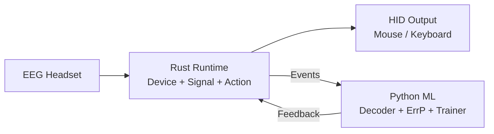

# NeuroHID

[](https://github.com/jmduea/NeuroHID/actions/workflows/ci.yml?query=branch%3Amain)
[](https://codecov.io/gh/jmduea/NeuroHID)

I built NeuroHID to control my computer with a cheap EEG headset. It reads
brain signals, figures out what you're trying to do, and moves the mouse or
presses keys — no special app integration needed, since it emits standard HID
events that look like any other mouse or keyboard.

It's very much a work in progress, but I find it useful and hope others do too.

## Why

Consumer EEG headsets are getting better and cheaper, but there's still no
straightforward way to go from "headset on head" to "computer does the thing I
was thinking about." NeuroHID tries to bridge that gap with a local-only system
that adapts over time instead of relying solely on one-time calibration.

## How It Works



**Rust** handles the real-time path: reading EEG samples, filtering signals,
extracting features, and emitting HID actions. **Python** handles the ML side:
a simplified REINFORCE-based decoder prototype and an error-related potential
(ErrP) classifier that provides implicit feedback — the idea being that the
system can learn from your brain's "that wasn't right" response instead of
needing explicit correction.

The two halves talk over local IPC (named pipe on Windows, TCP loopback
elsewhere). If Python crashes, the Rust service keeps running.

### What's an ErrP?

When your brain notices an unexpected or wrong outcome, it produces a
characteristic EEG pattern called an error-related potential. NeuroHID uses
this as a reward signal for online learning, so the decoder can improve over
time without you clicking "wrong" buttons.

## Architecture

Hybrid Rust/Python monorepo:

| Part | Stack | Location |
|---|---|---|
| Runtime, device backends, signal processing, HID output, GUI | Rust (edition 2024) + egui | `crates/` |
| ML decoder, ErrP classifier, trainer, bridge, notebooks | Python ≥ 3.12 + PyTorch | `python/` |

```text
┌──────────────────────────────────────────────────────────────────────┐
│                        RUST CORE SERVICE                             │
├──────────────────────────────────────────────────────────────────────┤
│  Device Backends ── Signal Pipeline ── Action Executor               │
│  (LSL/Serial/         (filter +         (mouse/keyboard              │
│   BrainFlow/Mock)      features)         via platform HID)           │
│         │                 │                      ▲                    │
│    EEG Samples        Features               Actions                 │
│         ▼                 ▼                      │                    │
│  ┌─────────────────────────────────┐   ┌─────────┴──────────┐        │
│  │     Ring Buffer / State         │   │  Platform Output    │        │
│  └────────────┬────────────────────┘   └────────────────────┘        │
│               │ IPC (local socket)                                    │
├───────────────┼──────────────────────────────────────────────────────┤
│               │          PYTHON ML LAYER                              │
│               ▼                                                       │
│  ┌──────────────┐    ┌──────────────┐                                │
│  │ ErrP Detector │    │   Decoder    │                                │
│  └──────────────┘    └──────────────┘                                │
└──────────────────────────────────────────────────────────────────────┘
```

### Entry Points

```bash
# Desktop GUI hub
cargo run -p neurohid --bin neurohid

# Headless service
cargo run -p neurohid --bin neurohid-service

# Validation harness (soak/latency/boot matrix)
cargo run -p neurohid --bin neurohid-validate

# Python ML bridge
uv run --directory python neurohid-ml bridge
```

## Status

Pre-production. Actively developed. The decoder is a simplified prototype,
not a production-grade model. Optimized for local operation and
research/developer iteration workflows.

## Docs

Full documentation index: [`docs/index.md`](./docs/index.md)

- [Development guide](./docs/development-guide.md) — setup, build, test, CI
- [Deployment & operations](./docs/deployment-guide.md) — runtime modes, transport config
- [Rust architecture](./docs/architecture-rust-core.md) — crate map and layer diagram
- [Protocol & API reference](./docs/protocol-and-api.md) — IPC v3 contract
- [Python package](./python/README.md) — CLI commands and ML workflows
- [Contributing](./CONTRIBUTING.md) — how to contribute
- [Changelog](./CHANGELOG.md)

Roadmap: [GitHub Issues](https://github.com/jmduea/NeuroHID/issues) and
[Milestones](https://github.com/jmduea/NeuroHID/milestones).

## License

Dual-licensed under MIT or Apache 2.0, your choice.
