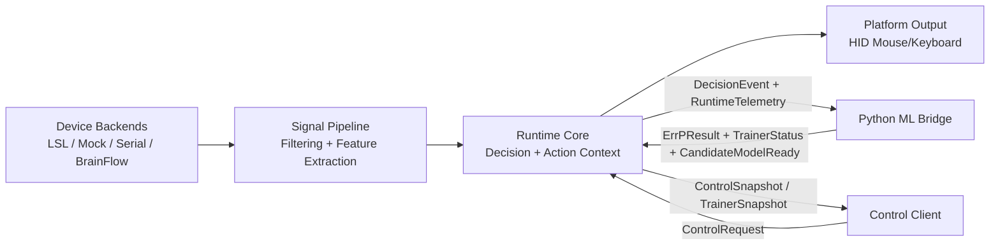
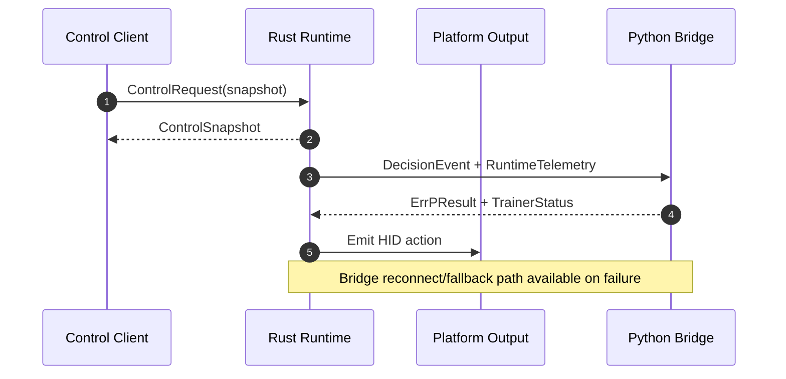

# Integration Architecture

## Cross-Part Integration

NeuroHID uses a local-process integration model between:

- Rust runtime/system services (`crates/`)
- Python ML bridge and training package (`python/`)

## Communication Pattern

- Primary direction: Rust runtime emits decision and telemetry events
- Feedback direction: Python returns ML/ErrP/training status and model lifecycle signals
- Transport: local named pipe (Windows) or local TCP loopback (cross-platform mode)
- Control: local control command endpoint for service snapshots and control commands

## Contract Surfaces

- Shared command and snapshot schema in `neurohid-types` (`control.rs`, config-related types)
- Bridge envelope and message kinds represented by Rust IPC crate and Python bridge package

## Failure Isolation

- Rust service can remain operational when Python bridge is unavailable
- Simulation/fallback behaviors are available for non-bridge or degraded scenarios
- Reconnect and control commands support runtime recovery workflows

## Data Flow (Logical)

1. Device/backend produces raw signal samples
2. Signal pipeline extracts runtime features
3. Runtime generates action/decision context and bridge events
4. Python bridge consumes events, applies model logic, emits status/results
5. Runtime applies outputs and updates control/telemetry state

## Device Discovery and Connection Lifecycle

For a detailed, code-anchored walkthrough of discovery → connect → stream behavior
across interactive and headless modes, see:

- `docs/plans/2026-02-15-device-discovery-connection-design.md`

LSL backend terminology note: framework traits remain `DeviceProvider`/`Device`,
while stream-native aliases (`LslStreamResolver`, `LslInletClient`) reflect
resolve/open-inlet semantics.

## Data Flow Diagram

## Transport Matrix

| Channel | Primary Producer | Primary Consumer | Mode |
|---|---|---|---|
| Runtime control | Local clients | Rust runtime/service | Named pipe or TCP loopback |
| Bridge uplink | Rust runtime | Python bridge | Named pipe (Windows) / TCP loopback |
| Bridge downlink | Python bridge | Rust runtime | Named pipe (Windows) / TCP loopback |

## Control and Bridge Sequence

