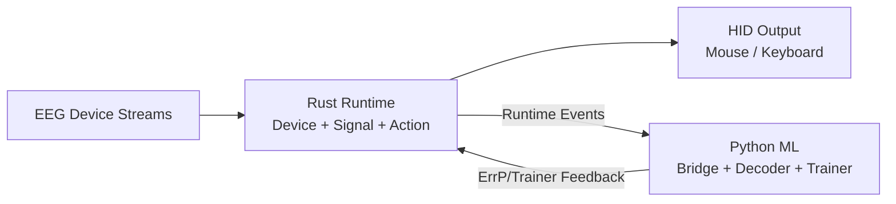

# NeuroHID Project Overview

## Executive Summary

NeuroHID is a hybrid Rust/Python monorepo that transforms EEG signals into standard HID input
(mouse/keyboard) using real-time signal processing and ML-assisted intent decoding.

## Repository Classification

- Type: Monorepo
- Parts: 2 primary parts
  - `rust-core` (`crates/`): runtime, device/signal/action stack, IPC, GUI, validation tools
  - `python-ml` (`python/`): bridge client, ErrP classifier, decoder/trainer, notebooks

## Technology Summary

| Category | Technology | Version/Signal | Evidence |
|---|---|---|---|
| Core language | Rust | Edition 2024 / rust-version 1.85 | `Cargo.toml` |
| Runtime | Tokio | Workspace dependency | `Cargo.toml` |
| Serialization | Serde + JSON/TOML | Workspace dependency | `Cargo.toml` |
| UI | egui + eframe | Workspace dependency | `Cargo.toml` |
| Python runtime | Python | >=3.12 | `python/pyproject.toml` |
| ML | PyTorch, NumPy, SciPy, scikit-learn | Declared deps | `python/pyproject.toml` |
| Notebook UX | JupyterLab | Declared dependency | `python/pyproject.toml` |
| CI/CD | GitHub Actions + Codecov | Multiple workflows present | `.github/workflows/*`, `codecov.yml` |

## Key Runtime Entry Points

- Rust GUI hub: `cargo run -p neurohid --bin neurohid`
- Rust service: `cargo run -p neurohid --bin neurohid-service`
- Rust validation harness: `cargo run -p neurohid --bin neurohid-validate`
- Python bridge CLI: `uv run --directory python neurohid-ml bridge`

## Architecture Snapshot

- Rust handles latency-critical runtime operations (device ingestion, signal features, action output)
- Python handles model experimentation/training and bridge-side ML workflows
- A local IPC boundary enables process isolation and controlled failure domains

## Architecture at a Glance

See:

- `architecture-rust-core.md`
- `architecture-python-ml.md`
- `integration-architecture.md`
